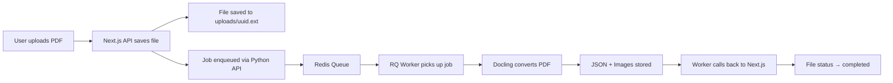
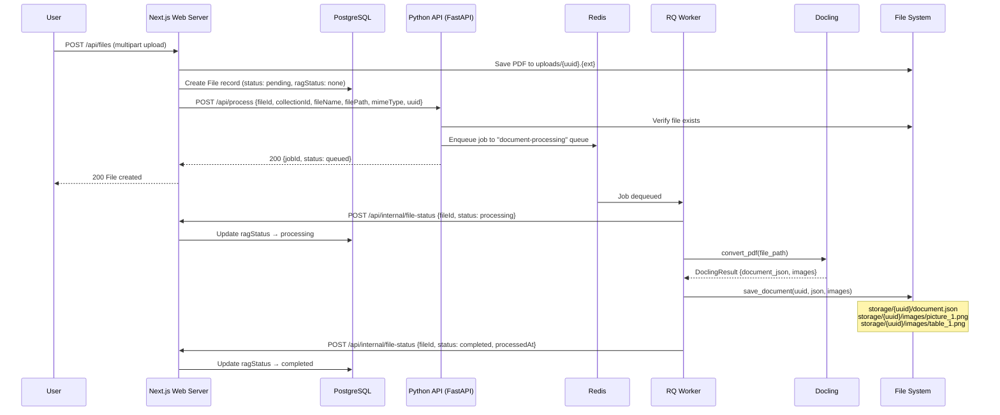
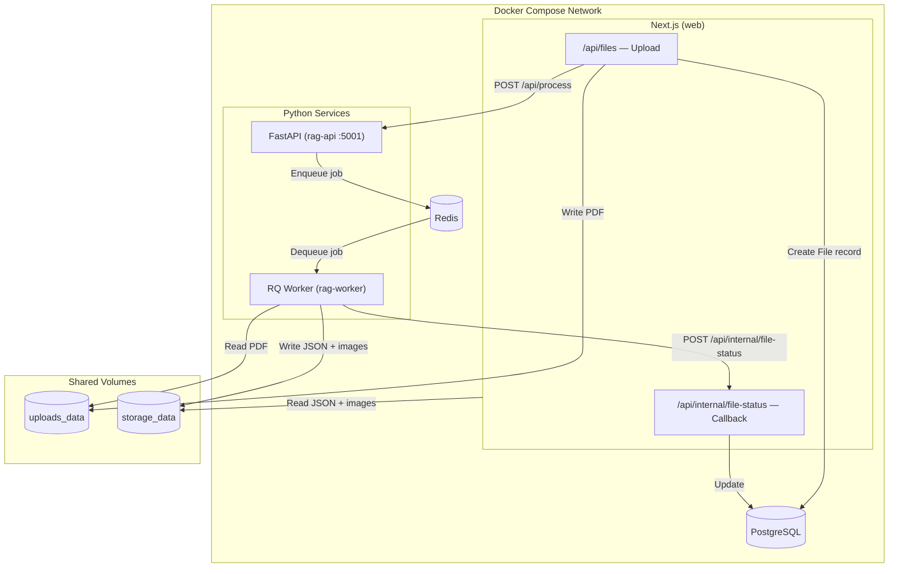
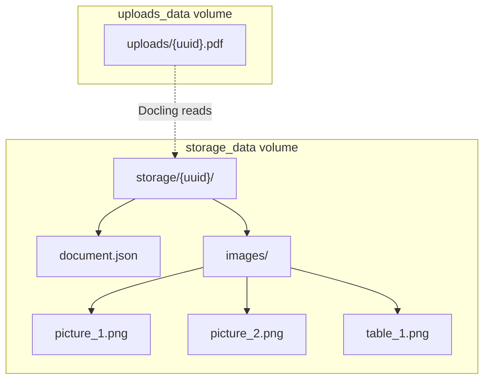
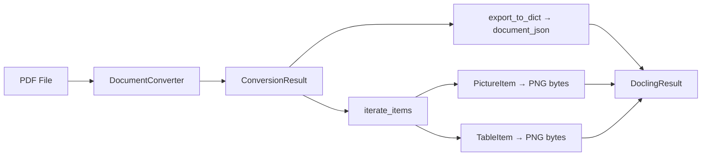
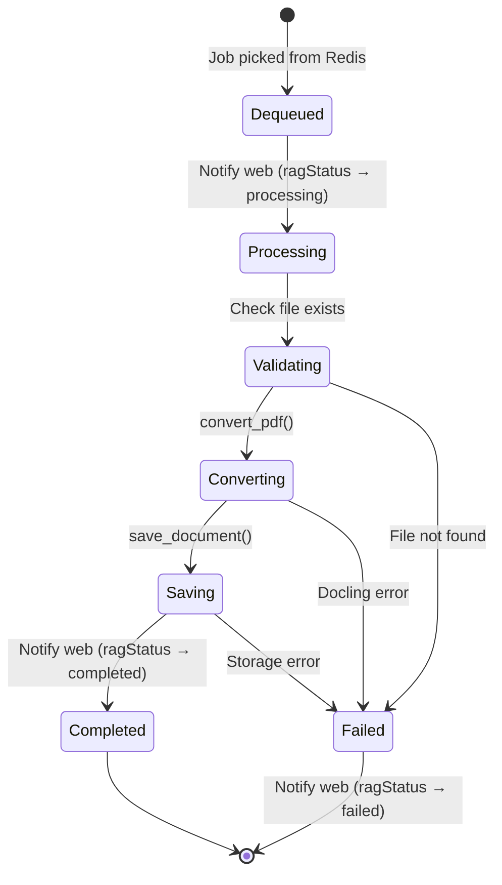
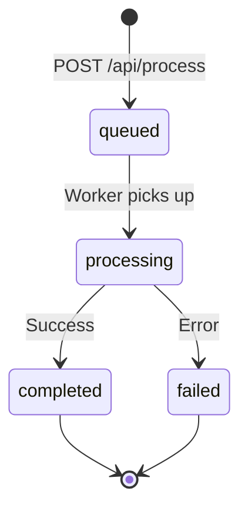
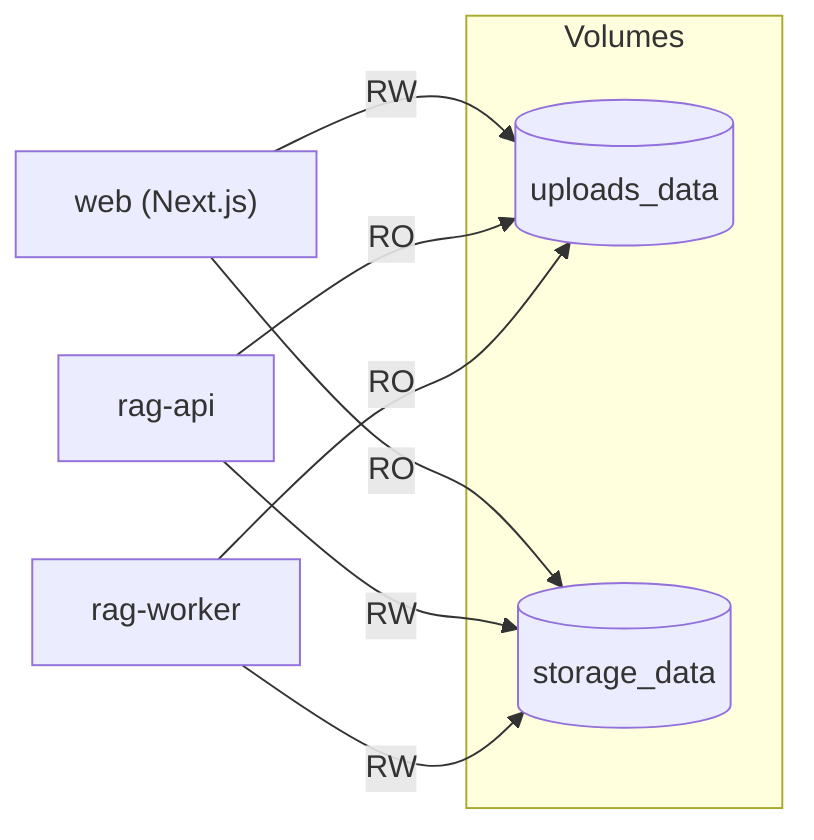

# Document Processing Pipeline

> Architecture reference for the Docling-based document ingestion pipeline.
> Last updated: 2026-03-13

---

## Overview

The document processing pipeline converts uploaded PDFs into structured JSON using [Docling](https://github.com/DS4SD/docling) and extracts embedded images. The Docling JSON is stored **as-is** — it is the canonical document representation and is never modified after creation.

This replaces the previous RAG pipeline (chunking, embeddings, BM25, reranking). The system now uses a **long-context approach**: full document content is loaded directly into the LLM context window at query time.

---

## High-Level Pipeline Flow



---

## Detailed Processing Sequence



---

## Service Architecture



---

## Storage Layout

Each processed document is stored under a UUID-based directory:

```
storage/
└── {uuid}/
    ├── document.json          # Docling JSON — immutable after creation
    └── images/
        ├── picture_1.png      # Extracted figures/diagrams
        ├── picture_2.png
        ├── table_1.png        # Rendered table images
        └── table_2.png
```



### Storage Rules

- **Immutability**: `document.json` is never modified after initial write.
- **UUID mapping**: The `File.uuid` field in PostgreSQL maps to the storage directory name.
- **Image naming**: Sequential counters — `picture_N.png` for figures, `table_N.png` for table renders.
- **Path traversal protection**: All image access functions reject `..`, `/`, and `\` in filenames.

---

## Docling Converter Module

**File**: `services/rag-service/src/ingestion/docling_converter.py`



### Configuration

| Setting | Value | Purpose |
|---------|-------|---------|
| `images_scale` | 2.0 | High-resolution image extraction |
| `generate_picture_images` | True | Extract embedded figures |
| `generate_page_images` | False | Skip full-page renders |
| `allowed_formats` | PDF only | Restrict to PDF input |

### API

```python
@dataclass
class DoclingResult:
    document_json: dict           # Raw Docling export
    images: Dict[str, bytes]      # filename → PNG bytes

def convert_pdf(pdf_path: str) -> DoclingResult
```

---

## Document Store Module

**File**: `services/rag-service/src/storage/document_store.py`

| Function | Signature | Purpose |
|----------|-----------|---------|
| `save_document` | `(uuid, docling_json, images, document_id=None) → Path` | Write JSON and images to disk |
| `get_document` | `(uuid) → dict` | Read and return `document.json` |
| `get_image_path` | `(uuid, filename) → Optional[Path]` | Resolve image path with traversal protection |
| `list_images` | `(uuid) → List[str]` | List all image filenames |
| `document_exists` | `(uuid) → bool` | Check if `document.json` exists |

---

## Worker Job Flow

**File**: `services/rag-service/worker.py`



### Progress Reporting

| Progress | Stage |
|----------|-------|
| 10% | Job started, notifying web |
| 20% | Starting Docling conversion |
| 70% | Docling conversion complete |
| 80% | Saving document and images |
| 95% | Document stored |
| 100% | Job complete |

---

## Python API Endpoints

**File**: `services/rag-service/main.py` — FastAPI on port 5001

| Method | Path | Purpose |
|--------|------|---------|
| POST | `/api/process` | Submit document processing job |
| GET | `/api/jobs/{job_id}` | Query job status and progress |
| GET | `/health` | Health check (includes Redis status) |
| GET | `/` | Service info |

### Job Lifecycle States



---

## Environment Variables

| Variable | Default | Service | Purpose |
|----------|---------|---------|---------|
| `RAG_REDIS_HOST` | `localhost` | API, Worker | Redis connection |
| `RAG_REDIS_PORT` | `6379` | API, Worker | Redis port |
| `RAG_PORT` | `5001` | API | FastAPI listen port |
| `RAG_WEB_CALLBACK_URL` | `http://localhost:3000` | Worker | Web server for status callbacks |
| `RAG_WEB_API_SECRET` | `changeme-in-production` | Worker | Auth header for callbacks |
| `DOCLING_STORAGE_PATH` | `storage` | Worker, Store | Base path for document storage |

---

## Volume Sharing (Docker)



---

## What Was Removed (Previous RAG Stack)

The following components were removed in favor of the long-context approach:

| Component | Purpose (Former) | Replacement |
|-----------|-----------------|-------------|
| ChromaDB | Vector store for embeddings | Removed — no embeddings needed |
| BGE-M3 | Embedding model | Removed |
| BM25 index | Keyword retrieval | Removed |
| Reranker | Result reranking | Removed |
| Chunking pipeline | Document splitting | Removed — full document in context |
| `/api/retrieve` endpoint | RAG retrieval | Removed — `document-loader.ts` reads JSON directly |
| LangChain | Orchestration | Removed |
| Sentence Transformers | Embedding generation | Removed |
| PyTorch | ML inference | Removed |
