# Web Layer Integration

> Architecture reference for the Next.js web service and its integration with document processing, LLM chat, and image serving.
> Last updated: 2026-03-13

---

## Overview

The web layer is a **Next.js** application that serves as the primary interface for users. It handles authentication, organization management, file uploads, chat with LLM, and image serving. It integrates with PostgreSQL (via Prisma), Redis, the Python document processing service, Ollama (LLM), and an optional voice service.

---

## System Architecture

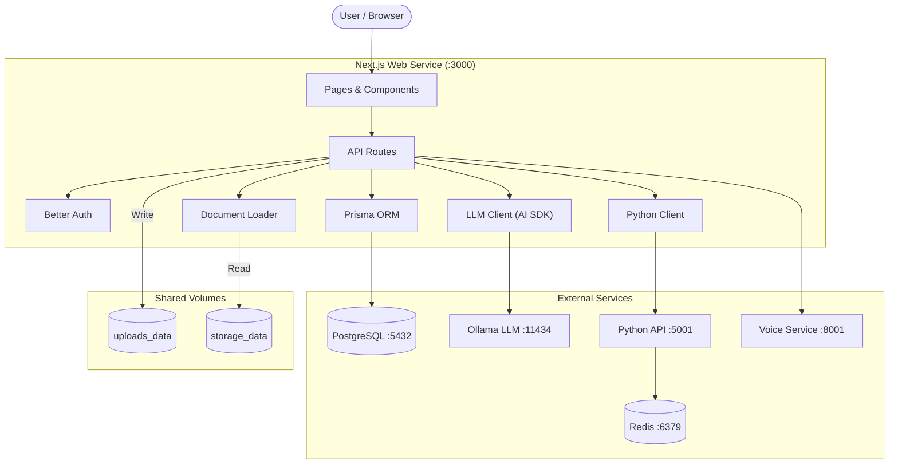

---

## API Route Map

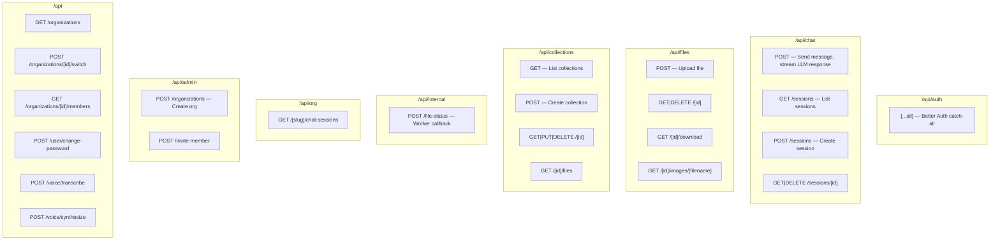

### Route Summary

| Route | Methods | Purpose |
|-------|---------|---------|
| `/api/auth/[...all]` | GET, POST | Authentication (sign-in, sign-up, sign-out, sessions) |
| `/api/chat` | POST | Stream LLM chat response with document context |
| `/api/chat/sessions` | GET, POST | List / create chat sessions |
| `/api/chat/sessions/[id]` | GET, DELETE | Get / delete a chat session |
| `/api/collections` | GET, POST | List / create document collections |
| `/api/collections/[id]` | GET, PUT, DELETE | Manage a collection |
| `/api/collections/[id]/files` | GET | List files in a collection |
| `/api/files` | POST | Upload a file and trigger processing |
| `/api/files/[id]` | GET, DELETE | File metadata / deletion |
| `/api/files/[id]/download` | GET | Download original uploaded file |
| `/api/files/[id]/images/[filename]` | GET | Serve extracted document images |
| `/api/internal/file-status` | POST, GET | Worker status callback (internal) |
| `/api/organizations` | GET | List organizations |
| `/api/organizations/[id]/switch` | POST | Switch active organization |
| `/api/organizations/[id]/members` | GET | List organization members |
| `/api/org/[slug]/chat-sessions` | GET | List chat sessions for an org |
| `/api/admin/organizations` | POST | Create organization (super admin) |
| `/api/admin/invite-member` | POST | Invite member to organization |
| `/api/user/change-password` | POST | Change user password |
| `/api/voice/transcribe` | POST | Speech-to-text via Voice Service |
| `/api/voice/synthesize` | POST | Text-to-speech via Voice Service |

---

## Chat Flow (Long-Context Approach)

This is the core workflow — how a user question becomes an LLM answer with full document context.

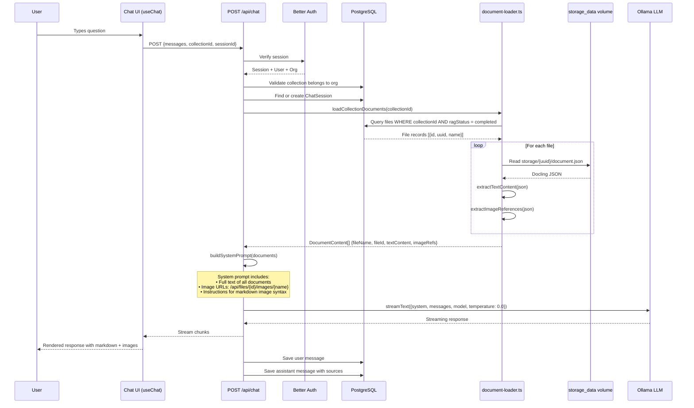

### System Prompt Structure

The system prompt injects all document content and image references:

```
You are a technical assistant with access to the following documents...

=== DOCUMENT 1: manual.pdf ===

[Full extracted text content including tables rendered as markdown]

Available images in this document:
- picture_1.png (URL: /api/files/abc123/images/picture_1.png) -- Hydraulic pump assembly (page 47)
- table_1.png (URL: /api/files/abc123/images/table_1.png) (page 12)

=== DOCUMENT 2: spec.pdf ===
...

When referencing an image, use markdown image syntax:

```

---

## File Upload Flow

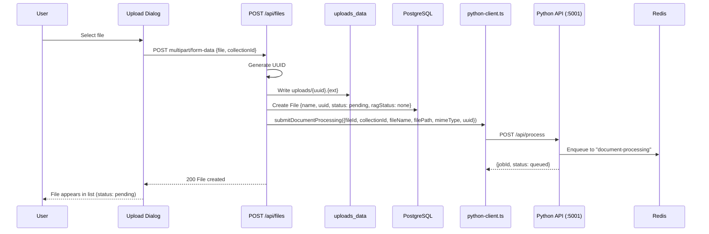

---

## Image Serving Flow

When the LLM references an image in its response, the browser fetches it through this route.

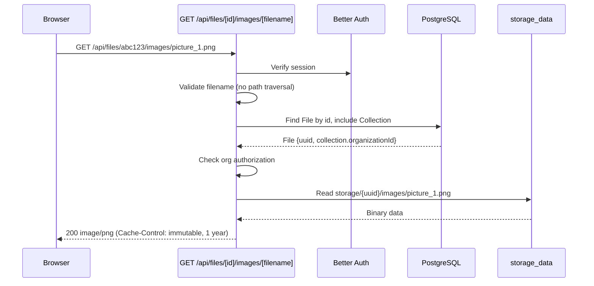

### Security Controls

- **Authentication**: Session required via Better Auth.
- **Authorization**: User's active org must match the file's collection org (or super admin).
- **Path traversal**: Filenames containing `..`, `/`, or `\` are rejected.
- **Caching**: Images are immutable — cached for 1 year.

---

## Worker Status Callback Flow

The Python worker notifies Next.js of processing progress through an internal API.

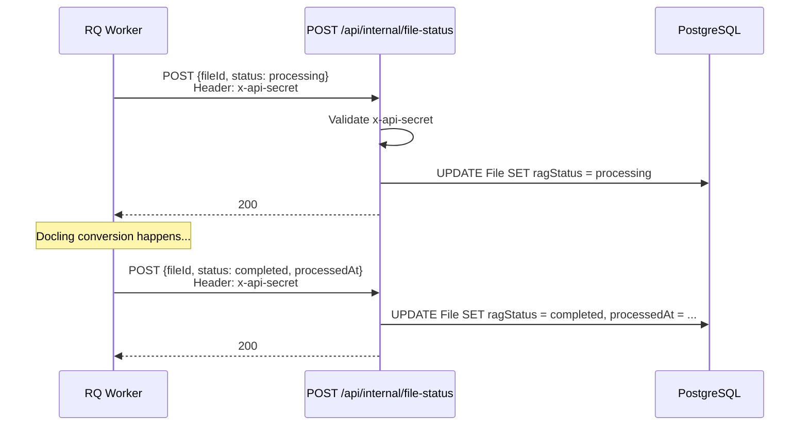

---

## Database Schema (Core Models)

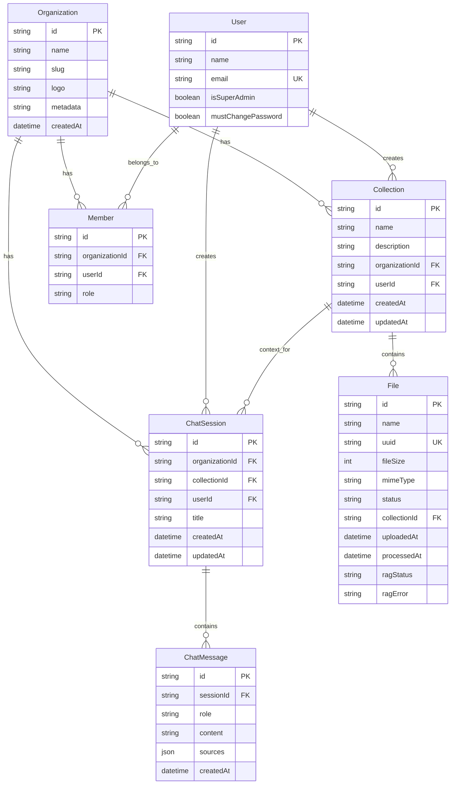

### Key Fields for Document Pipeline

| Model | Field | Role in Pipeline |
|-------|-------|-----------------|
| `File.uuid` | Maps to `storage/{uuid}/` directory |
| `File.ragStatus` | Tracks processing: `none` → `processing` → `completed` / `failed` |
| `File.ragError` | Stores error message if processing fails |
| `File.processedAt` | Timestamp when Docling conversion completed |
| `Collection.id` | Groups files; used by `loadCollectionDocuments()` to load context |

---

## Frontend Component Architecture

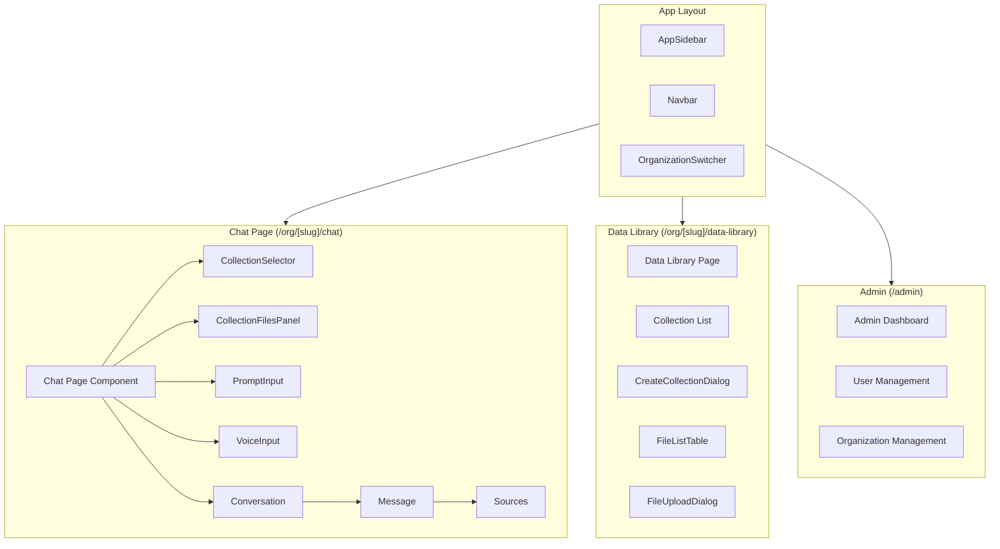

### Chat UI Data Flow

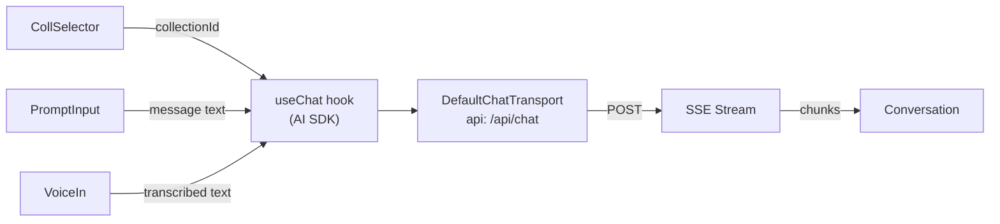

---

## Authentication & Authorization

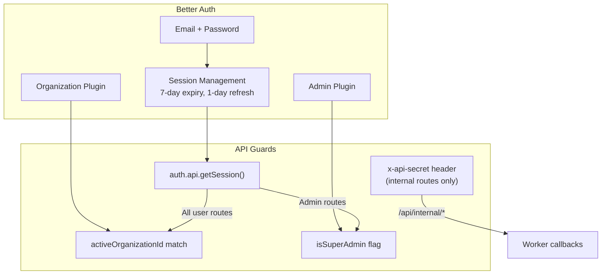

### Access Control Matrix

| Route Category | Auth Required | Org Scoped | Super Admin Only |
|---------------|:---:|:---:|:---:|
| `/api/chat` | Yes | Yes | No |
| `/api/files` | Yes | Yes | No |
| `/api/collections` | Yes | Yes | No |
| `/api/files/[id]/images/*` | Yes | Yes | No |
| `/api/organizations` | Yes | — | No (filtered) |
| `/api/admin/*` | Yes | — | Yes |
| `/api/internal/*` | No (API secret) | — | — |

---

## LLM Integration

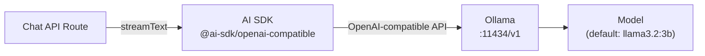

### Configuration

| Variable | Default | Purpose |
|----------|---------|---------|
| `LLM_SERVICE_BASE_URL` | `http://localhost:11434/v1` | Ollama endpoint |
| `LLM_MODEL` | `llama3.2:3b` | Default model name |

The LLM receives `temperature: 0.0` for deterministic outputs appropriate for safety-critical technical content.

---

## Voice Integration

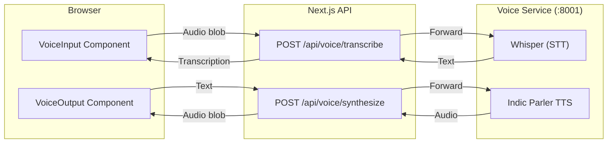

---

## End-to-End Data Flow Summary

```mermaid
flowchart TB
    Upload["1. Upload PDF"]
    Store["2. Save to uploads/{uuid}.ext"]
    Enqueue["3. Enqueue processing job"]
    Convert["4. Docling converts PDF"]
    Persist["5. Store JSON + images in storage/{uuid}/"]
    Callback["6. Mark file as completed"]
    Chat["7. User asks question"]
    Load["8. Load all collection documents from disk"]
    Prompt["9. Build system prompt with full text + image URLs"]
    LLM["10. Stream LLM response"]
    Render["11. Render response with inline images"]
    Serve["12. Browser fetches images via /api/files/[id]/images/[name]"]

    Upload --> Store --> Enqueue --> Convert --> Persist --> Callback
    Chat --> Load --> Prompt --> LLM --> Render --> Serve
    Callback -.->|ragStatus: completed| Load
    Persist -.->|storage/{uuid}/| Serve
```
